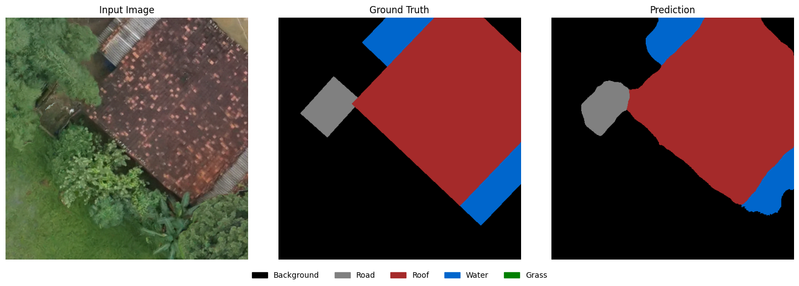

<div align="center">
  <h1>SVAMITVA-Net</h1>
  <p>A deep learning pipeline for 5-class semantic segmentation of high-resolution drone imagery, supporting the SVAMITVA scheme's goal of mapping residential land ownership in rural areas.</p>
</div>

---

## Architecture

- **Model:** U-Net (`segmentation_models_pytorch`) with a ResNet34 encoder, trained from scratch (no ImageNet init).
- **Input:** 3-channel RGB, 512x512.
- **Output:** 5-class semantic segmentation — `Background`, `Road`, `Roof`, `Water`, `Grass` (see [src/audit_palette.py](src/audit_palette.py)).

This is confirmed, not assumed: [weights/svamitva_refined_v2_e5.pth](weights/svamitva_refined_v2_e5.pth) loads into `smp.Unet(encoder_name='resnet34', in_channels=3, classes=5)` with `strict=True` — zero missing or unexpected keys. Class 0 (`Background`) is confirmed by pixel share (~85% of labeled pixels, the expected majority class for rural aerial imagery); the index order for classes 1-4 was inferred from per-class RGB color signature and confirmed visually against the model's own predictions (see the audit image below — the red "Roof" class lines up exactly with the tiled roof in the input photo, blue "Water" with the pond).

## Verified Results

Computed by [src/evaluate.py](src/evaluate.py) against the 29 labeled patches in `data/samples/` — run it yourself to reproduce:

```
python src/evaluate.py
```

| Class | IoU |
|---|---|
| Background | 98.59% |
| Road | 91.38% |
| Roof | 94.00% |
| Water | 92.03% |
| Grass | 88.17% |
| **Mean IoU (all 5 classes)** | **92.83%** |
| **Mean IoU (excluding background)** | **91.39%** |

<div align="center">
  
  <br/>
  <em>Input / Ground Truth / Prediction for patch_000088, rendered with the class palette above via src/audit.py</em>
</div>

## How to Run

```bash
pip install -r requirements.txt

# Reproduce the metrics above
python src/evaluate.py

# Run on a single image (.png/.jpg/.tif or .npy patch) and save a colored mask
python src/inference.py path/to/image.png -o prediction.png

# Train/fine-tune on a labeled patch directory
python src/train.py --data-dir data/samples --epochs 5

# Launch the interactive demo (see Interactive Demo below)
python src/app.py

# Run the test suite
python -m unittest discover -s tests
```

## Interactive Demo

[src/app.py](src/app.py) is a Gradio UI: pick a labeled patch from a gallery, run the model, and see Input / Ground Truth / Prediction side by side with a live per-class IoU readout — adapted from an earlier prototype audit tool, rewired to the confirmed 5-class model and palette above.

```bash
python src/app.py
```

Verified: the app builds and actually serves — launched locally and confirmed a live HTTP 200 response with real Gradio page content. The gallery-click callback (`run_audit`) was also exercised directly and returns correct image shapes and a sane per-class IoU breakdown, e.g. `Mean IoU: 88.65% | Background: 96.1% Road: 86.3% Roof: 96.2% Water: 76.1%` on one sample patch.

## Geospatial Output

The MoPR hackathon's OGC problem statement (`OGC Document.pdf`) asks for extracted features as a **GeoPackage (GPKG)** of vector polygons, not a flat image mask. [src/vectorize.py](src/vectorize.py) closes that gap: it reads a georeferenced GeoTIFF, runs the model, and polygonizes each class's prediction into a CRS-tagged GeoPackage using `rasterio.features.shapes` + `geopandas`.

```bash
python src/vectorize.py data/geo_demo/patch_000088_georeferenced.tif -o prediction.gpkg
```

This is verified, not just written: running it produces a real GeoPackage with valid geometries, correct `EPSG:4326` CRS, real-world coordinates in the Bengaluru bounding box, and class labels matching the palette (`Water`, `Road`, `Roof`) that line up with the visible pond/path/roof in that same patch's audit image above. Running it also surfaced and fixed a real bug: `mask_to_geodataframe` crashed when a prediction contained zero non-background polygons (an empty `GeoDataFrame` has no geometry column to attach a CRS to) — now handled explicitly.

`data/geo_demo/` contains two files:
- `SVAMITVA_Final_Raster.tif` — the hackathon-provided sample raster. Worth knowing: its pixel values are binary (0/1, not 0-255), and it pairs with a reference file (`SVAMITVA_Final_Features.gpkg`) containing a single polygon. This means it's a **reference/label raster**, not raw RGB drone photography — running the segmentation model on it directly yields an all-background prediction, since it isn't the kind of input the model was trained on.
- `patch_000088_georeferenced.tif` — a real labeled RGB patch from `data/samples/` re-saved as a GeoTIFF (using the sample raster's real CRS/transform as a stand-in, since the `.npy` patches don't carry their own coordinates). This is genuine photographic input the model can interpret, and is what the example command above uses.

## Data

Training/evaluation data is 512x512 RGB patches from the MoPR SVAMITVA hackathon drone dataset, labeled with the 5-class scheme above. A 29-patch subset (stratified to include all 5 classes) is included in `data/samples/` so the evaluation above is reproducible without external downloads. `data/geo_demo/` has the georeferenced sample raster/vector pair used by `vectorize.py`.

---

## Development History

The screenshots and video below are from an earlier prototype iteration of this pipeline — a binary/4-class building-extraction formulation that reported 95.66% IoU on that (easier, fewer-class) task. That prototype predates the 5-class `v2` model currently shipped in `weights/`, uses a different class scheme, and was evaluated on different patches than the results above. It's kept here as development history, not as a claim about the current model's performance — see **Verified Results** above for numbers reproducible against the checkpoint in this repo.

<div align="center">
  <h3>Prototype Visual Audit & Pipeline Demo</h3>
  <video src="assets/Untitled0.ipynb - Colab - Google Chrome 2026-03-30 19-54-24.mp4" controls="controls" width="800"></video>
  <br><br>
  
  <br><br>
  
  <br><br>
  
  <br><br>
  
</div>
